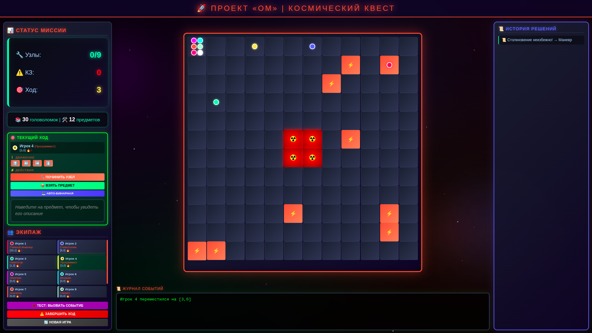
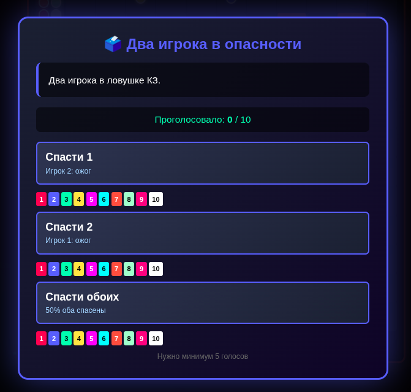
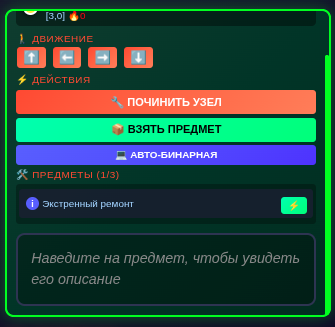
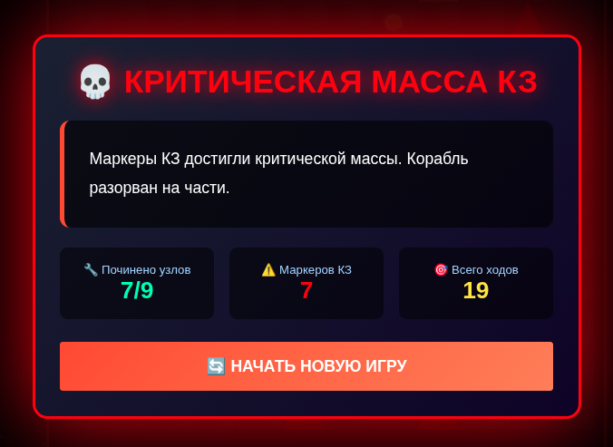

# 🚀 Космический Квест: Проект «ОМ»

[](https://www.java.com/)
[](https://spring.io/projects/spring-boot)
[](https://www.postgresql.org/)

> **Кооперативная настольная игра в цифровом формате.** Управляйте экипажем из 10 уникальных специалистов, чините узлы корабля, принимайте сложные сюжетные решения и попытайтесь выжить в условиях распространения Логического Вируса.

---

## 🎮 Особенности игры

- 🗳️ **Сюжетные голосования:** Каждые несколько ходов экипаж сталкивается с критической ситуацией. Исход зависит от коллективного решения (12 уникальных концовок!).
- 👨‍🚀 **10 Уникальных ролей:** От Главного Инженера до Стажера. У каждого есть пассивные и активные способности.
- 🛠️ **12 Предметов:** Мультиметр, Паяльная станция, Аварийный генератор и другие. У каждого предмета есть свое описание и механика применения.
- 🌌 **Глубокий лор:** Несколько взаимосвязанных сюжетных линий (Пришельцы, Аномалии, ИИ, Связь с Землей).
- 🎨 **Адаптивный космический UI:** Анимированный фон, неоновые элементы и удобная компоновка экрана без необходимости прокрутки.

---

## 🖼️ Галерея интерфейса

*(Здесь будут ваши скриншоты после добавления их в папку `images`)*

### Главный экран
Игровое поле 12x12, статус миссии, управление экипажем и журнал событий.


### Сюжетные голосования
Коллективное принятие решений, влияющих на судьбу корабля и открывающих разные ветки сюжета.


### Система предметов
Наведите курсор на предмет, чтобы увидеть подробное описание его эффекта.


---

## 🎬 Сюжетные концовки

В игре реализовано **12 уникальных финалов**, которые зависят от ваших решений в голосованиях, состояния корабля и отношений с другими фракциями. Попробуйте найти их все!

### ✨ Хорошие концовки (Good Endings)
*   **🌟 Новый дом:** Экипаж находит планету дружелюбных пришельцев и основывает колонию.
*   **🏠 Возвращение домой:** Все узлы починены, экипаж возвращается на Землю героями.
*   **🛸 Приглашение на планету:** Пришельцы забирают экипаж к себе, даже если корабль не до конца починен.
*   **🕊️ Дипломатическая победа:** Удаётся договориться с разгневанными пришельцами после конфликта.
*   **🏴‍☠️ Свободные капитаны:** Экипаж выбирает путь свободы и исследований вместо возврата домой.
*   **🧠 Цифровое бессмертие:** Слияние с ИИ позволяет экипажу жить вечно в цифровом виде.
*   **🕯️ Память о герое:** Жертва одного члена экипажа спасает остальных.
*   **🚀 Герои-выжившие:** Спасение на шлюпках ценой потери корабля.

### ⚖️ Нейтральные и Плохие концовки
*   **👽 Гнев пришельцев:** Конфликт с инопланетной расой приводит к уничтожению корабля.
*   **⚔️ Война с пришельцами:** Победа в бою делает экипаж новыми тиранами космоса.
*   **💀 Поглощены черной дырой:** Полный провал миссии из-за гибели всего экипажа.
*   **💀 Критическая масса КЗ:** Вирус берет верх, и корабль разрывает на части.



---

## 🛠️ Технологический стек

- **Backend:** Java 17, Spring Boot 3.2.3, Spring Data JPA
- **Database:** PostgreSQL
- **Frontend:** Thymeleaf, HTML5, CSS3 (Grid/Flexbox, анимации), Vanilla JavaScript
- **Build Tool:** Maven

---

## ⚙️ Как запустить проект локально

### 1. Требования
- Java 17 или выше
- Maven 3.6+
- PostgreSQL (созданная база данных `om_game` и пользователь `om_user`)

### 2. Настройка базы данных
Убедитесь, что в файле `src/main/resources/application.properties` указаны корректные данные:
```properties
spring.datasource.url=jdbc:postgresql://localhost:5432/om_game
spring.datasource.username=om_user
spring.datasource.password=om_password
spring.jpa.hibernate.ddl-auto=update
```
### 3. Запуск приложения
```bash
mvn clean spring-boot:run
```
Откройте браузер и перейдите по адресу: http://localhost:8080
### Автор
**Никита Путенцев**
📧 [nikitaputintsev@gmail.com](mailto:nikitaputintsev@gmail.com)
🔗 [GitHub Profile](https://github.com/NikitaPut)

*Сделано с ❤️ и ☕ для любителей космических приключений.*
